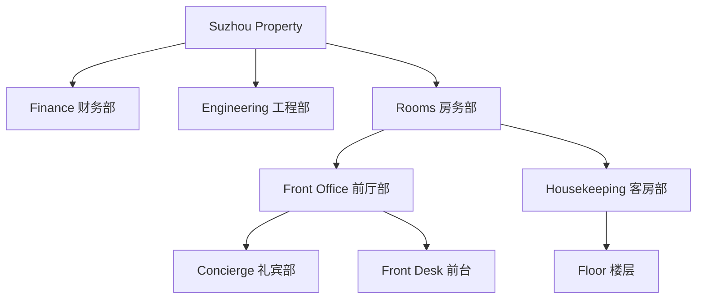

# Checkpoint 2C — Suzhou Hotel Real-Data Foundation Design Specification

**Status:** Proposed for user review
**Product focus:** One operational Suzhou hotel
**Data mode:** Hybrid
**Foundation:** Preserve Checkpoint 2B.1 tenancy, membership, role assignment, trainer scope, and RLS architecture

## 1. Outcome

Checkpoint 2C makes the current Suzhou hotel usable with real property settings, organization, position, employee, and import data while preserving the approved Milestone 1 experience. The schema remains tenant- and property-isolated, but the product exposes no hotel-group or broad multi-property administration in this checkpoint.

The implementation supports one active tenant, one active property, and one primary hotel hostname. The hostname establishes context only; every real-data operation still requires an authenticated user with an active membership and appropriate property role.

## 2. Locked product boundaries

1. Preserve all Checkpoint 2B.1 tables, helpers, RLS policies, tests, and migration history.
2. Preserve multi-property capability in the database schema.
3. Build operational UI only for the current property.
4. Do not build group administration, cross-property dashboards, wildcard onboarding, or customer-owned-domain management.
5. Move only Hotel Settings, organization management, department mapping, position mapping, People Center identity data, and Import Center to Supabase.
6. Keep dashboard metrics, training, sessions, QR flows, and KPI actual calculations on mock data.
7. Do not apply migrations or seeds to production without a separate approval after full local verification.
8. Do not hardcode real hotel data or credentials in migrations, source files, or committed seed files.

### 2.1 Review Stop 2C-A synthetic-data boundary

Review Stop 2C-A uses synthetic local property fixtures only. Migrations and committed seeds must not contain the real Suzhou hotel name, property code, domain, logo, administrator identity, employee data, or any other production hotel value. The Hotel Settings Center demonstrates the approved workflow locally; real hotel identity is entered later by an authorized administrator after separate production approval.

## 3. Chosen architecture

### 3.1 Property-scoped hybrid vertical slice

The selected approach is an incremental hybrid slice:

- Real repositories serve settings, official organization, positions, employees, and import operations.
- Mock repositories continue serving all training and analytical modules.
- Page components depend on repository contracts and application services, never on direct Supabase queries.
- A module-level repository registry selects real or mock implementations when `APP_DATA_MODE=hybrid`.

This is preferred over a big-bang migration because training history and KPI definitions are not yet reliable enough to present as real. It is preferred over a UI-only staging prototype because the current goal is a genuinely usable employee master and organization foundation.

### 3.3 Mainland-China deployment posture

ChatGPT Sites remains a design and prototype preview surface only. It is not the final hotel production host for `ktsz.ldchub.cn`: mainland-China testing still resolves through the inaccessible `chatgpt.site` hosting chain.

The production application must therefore be deployable independently from GitHub repository `nicwenqi/ld_os`, without depending on Sites-specific runtime behavior. The first pilot database remains the Supabase project in `ap-southeast-1`.

Checkpoint 2C adds deployment readiness as a design and verification workstream, but does not select or provision a production hosting provider. It covers:

- compatibility with an independent frontend host;
- SPA route fallback for every application route and mobile QR route;
- environment-variable injection for Supabase URL, publishable key, application mode, base domain, and property hostname;
- custom-domain configuration requirements for `ktsz.ldchub.cn`;
- mainland-China DNS, TLS, browser, Supabase, and QR-link network checks;
- rollback to the previous DNS target without changing database state.

No DNS record, hosting provider, production deployment, or Site publication is changed in this checkpoint.

### 3.2 Real and mock module matrix

| Module | Checkpoint 2C source |
|---|---|
| Hotel Settings Center | Supabase |
| Organization management tree | Supabase |
| Department Claim and Mapping | Supabase |
| Position mapping | Supabase |
| People Center identity and employment data | Supabase |
| Import Center | Supabase |
| Executive Dashboard | Mock, visibly marked as example data |
| Organization Dashboard metrics | Mock, visibly marked as example data |
| Course Effectiveness | Mock |
| Risk Dashboard | Mock |
| Training Calendar and sessions | Mock |
| QR check-in and feedback | Mock |
| KPI actual calculations | Mock |

Real employees must not display fabricated training history. Until training records are migrated, People Center shows a polished `培训记录尚未接入 / Training records not connected` state. Assignment and make-up actions remain visibly identified as prototype actions.

## 4. One active hotel context

### 4.1 Hostname resolution

`property_domains` resolves the request hostname to a tenant and property. Review Stop 2C-A configures one synthetic active primary record locally. The real Suzhou primary record is created later through the approved administrator workflow after production approval.

Resolution rules:

- Normalize the hostname to lowercase and remove any port.
- Reject unknown, inactive, or unverified domains.
- Return only safe property identity and branding before authentication.
- Require active membership before any business table is read.
- Use `DEV_PROPERTY_HOSTNAME` for local development and `PREVIEW_PROPERTY_HOSTNAME` for preview.
- Do not expose domain creation or ownership management in the application.

### 4.2 Initialization workflow

The property L&D Manager completes a single-property initialization checklist:

1. Confirm official identity.
2. Upload logo.
3. Confirm business rules.
4. Create or confirm the official department tree.
5. Resolve department labels.
6. Resolve position labels.
7. complete the first employee import.

Initialization status is derived from persisted completion facts. It cannot be manually changed to complete while required sections are invalid.

## 5. Hotel Settings Center

**Route:** `/settings/hotel`

### 5.1 Basic information

- Official Chinese hotel name
- Official English hotel name
- Short display name
- Property code
- Brand
- City
- Country/region
- Timezone
- Default language
- Active/inactive state, restricted to authorized administrators

### 5.2 Business rules

- New employee definition in days
- Probation field meaning: probation end date, confirmation date, or unused
- Employee active-status source: workbook import, manual maintenance, or future HRIS
- CTC mandatory setting
- GTC mandatory setting

Rules are property-specific. Changing a rule shows an impact explanation before save; it does not retroactively rewrite imported source data.

### 5.3 Logo

The logo is stored in the public `property-brand-assets` bucket under a versioned, non-guessable path:

`{tenant_id}/{property_id}/branding/{asset_uuid}/logo-v{version}.{extension}`

Allowed formats are PNG, JPEG, and WebP. Upload validates MIME type, file extension, size, and property-owned path. Employee data, workbooks, imports, and private files are prohibited from this bucket.

Because the bucket is public, anyone with an object URL can retrieve that object and public retrieval does not depend on object-level RLS. RLS controls authenticated metadata/list operations needed by the client plus upload, update, move/copy, and delete, always within an authorized tenant/property path.

Replacing a logo creates a new immutable object and marks the previous metadata record non-current. Replaced versions are retained for 30 days for rollback; expired non-current objects may then be removed through the Storage API by an authorized property manager. Review Stop 2C-A does not add a scheduled cleanup service.

### 5.4 Save behavior

- Each section validates independently.
- Save returns a visible success or field-level error state.
- Unsaved changes are indicated.
- Concurrent updates use `updated_at` optimistic concurrency.
- Technical identifiers are never shown in the UI.

## 6. Department hierarchy

### 6.1 Model

`departments` stores direct parentage. `department_closure` stores every ancestor/descendant pair and depth.

Every department contains tenant, property, bilingual names, optional business code, parent, depth, sort order, active state, effective dates, and audit fields. The closure table is property-scoped and cannot contain cross-property relationships.

### 6.2 Mutations

Official organization changes use controlled database functions rather than direct client updates:

- Create top-level department
- Create child department
- Rename or edit bilingual labels
- Activate/deactivate
- Reorder siblings
- Preview a move
- Move a subtree

A move preview returns:

- old and proposed paths;
- moved department count;
- affected direct and descendant employees;
- aliases and operational units attached to the subtree;
- trainer scopes whose reporting path changes;
- a version token tied to the current tree state.

The move operation accepts the preview token and runs atomically. It rejects self-parenting, cycles, stale previews, inactive targets where prohibited, and cross-property parenting. It updates parent, closure, depth, and path-derived data in one transaction.

Deactivating a parent with active descendants requires explicit cascade confirmation. No implicit cascade is allowed.

## 7. Department Claim and Mapping Center

**Route:** `/organization/mapping/departments`

Workbook department labels enter staging before they can affect official organization data. Original text is retained exactly; normalized text is used only for matching.

### 7.1 Source view

- Original source label
- Normalized label
- Employee count
- Source file and sheet
- Automatic suggestion
- Confidence
- Resolution status
- Sample affected employees

### 7.2 Official organization view

- Searchable official department tree
- Selected target path
- Parent selector for new departments
- Top-level/child creation action
- Operational-unit classification
- Employee impact preview
- Final confirmation

### 7.3 Resolution actions

- Map to an existing official department
- Create a new top-level department
- Create a child under a selected parent
- Classify as an operational unit
- Save as an alias
- Merge multiple source labels into the same official target
- Ignore
- Defer

Suggestions never mutate the official tree. Creating a department or operational unit requires a separate confirmation. Approved aliases and resolution rules are reused on later imports. A deferred label blocks only affected rows. Ignoring a department label excludes its affected employee rows because imported employees require an official department.

## 8. Operational units

Operational units are property-scoped venues, outlets, or working units that are not official HR departments. An employee belongs to one official department and may optionally belong to one operational unit.

Default behavior:

- Permissions and official KPI aggregation follow the official department tree.
- Operational units can be used as People Center filters.
- Operational-unit aliases are reused in later imports.
- Classification never automatically creates an official department.

## 9. Positions and position mapping

**Route:** `/organization/mapping/positions`

The model separates:

- Official hotel positions
- Source aliases
- Optional normalized position families
- Original source position values retained in staging/audit

Each source position displays its original label, employee count, department distribution, suggestion, confidence, selected official position, optional family, and affected-employee preview.

Actions are map, create official position, create/assign family, save alias, merge equivalent source labels, ignore, and defer. Position families are optional and do not replace official positions. The 113 observed source position values remain individually reviewable; no automatic collapse to four generic roles is permitted.

## 10. Employee master

`employees` stores current property identity and employment data:

- Employee number as text
- Chinese name
- English name
- Official department
- Optional operational unit
- Official position
- Grade
- Hire date
- Probation/confirmation date
- Active/inactive status
- Optional linked profile
- Last applied import batch
- Audit timestamps

`employee_external_identifiers` stores property-scoped HR/LMS identifiers without replacing the hotel employee number.

Constraints:

- Preserve leading zeros.
- Trim surrounding whitespace only.
- Enforce unique `(property_id, employee_number)`.
- Never match by name alone.
- Never deactivate an employee because they are absent from a workbook.
- Never move an employee to an unresolved department or position.

## 11. Real import workflow

**Route:** `/import`

### 11.1 State flow

1. Upload workbook to private Storage.
2. Validate file type, size, hash, and uploader scope.
3. Detect sheets.
4. Select the employee master sheet.
5. Confirm field mapping.
6. Parse and preview employee rows.
7. Extract department labels.
8. Resolve department labels.
9. Extract position labels.
10. Resolve position labels.
11. Validate employee rows.
12. Review additions, updates, exclusions, and unresolved rows.
13. Confirm final import.
14. Apply employee changes atomically.
15. Retain source, issues, resolutions, applied changes, and history.

### 11.2 Parsing boundary

The original workbook is stored privately. Parsing runs in a dedicated authenticated server-side import function, not inside page components. The parser writes staging rows using the caller's authenticated context so RLS remains effective. The parser adapter must support the real legacy `.xls` workbook and later `.xlsx`/`.csv` files after a compatibility test selects and pins the library.

### 11.3 Validation outcomes

Every row receives one outcome:

- Addition
- Update
- Exclusion
- Unresolved
- Invalid

Blocking issues include missing/duplicate employee number, ambiguous identity collision, missing required name, unresolved department, unresolved position, invalid required date, and cross-property target. Warnings include optional English name, grade, status, and date concerns permitted by hotel rules.

Missing status does not silently deactivate an employee. Workbook absence is not a termination signal.

### 11.4 Audit and guarded reversal

Every applied row records source row, action, employee, before snapshot, after snapshot, actor, and timestamp. A completed batch may be reversed only when affected employee records have not changed since that batch. If later edits exist, reversal is refused and an impact report is produced for manual resolution.

Training history, CTC/GTC completion, and KPI data are not part of the employee transaction.

## 12. Database model

### 12.1 Property context

- Extend `properties`: brand, city, country/region, timezone, default language
- `property_domains`
- `property_settings`
- `property_brand_assets`

### 12.2 Organization

- `departments`
- `department_closure`
- `department_aliases`
- `operational_units`
- `operational_unit_aliases`

### 12.3 Positions and employees

- `position_families`
- `positions`
- `position_aliases`
- `employees`
- `employee_external_identifiers`

### 12.4 Import staging and audit

- `import_batches`
- `import_sheets`
- `import_field_mappings`
- `import_source_rows`
- `import_source_labels`
- `import_issues`
- `import_resolution_rules`
- `import_applied_changes`

JSON is allowed for raw staging values and before/after audit snapshots. It is not used as a generic replacement for normalized business tables.

## 13. RLS design

All exposed tables enable and force RLS. Authorization continues to originate from active membership, role assignment, and trainer scope tables.

| Actor | Settings | Organization | Employees | Import/mapping |
|---|---|---|---|---|
| Platform administrator | Manage all | Manage all | Manage all | Manage all |
| Tenant administrator | Manage own tenant | Manage own tenant | Manage own tenant | Manage own tenant |
| Property L&D Manager | Manage property | Manage property | Manage property | Manage property |
| Department training administrator | Read property rules | Read assigned branches | Read assigned branches | No access |
| Employee participant | Safe property identity | No administration | Own linked record only | No access |
| Anonymous | Safe domain/branding resolver only | None | None | None |

Add `app_private.is_department_in_user_scope(p_department_id uuid)`. It starts from `auth.uid()`, reads trainer scopes and closure rows with a fixed empty search path, uses fully qualified names, and avoids caller-supplied user IDs and recursive RLS.

Organization mutation and import-commit functions are narrowly scoped `security definer` functions only where atomic privileged maintenance is required. Each one:

- lives behind explicit `authenticated` grants;
- revokes `PUBLIC` and `anon` execute;
- starts from `auth.uid()`;
- checks active membership and exact property role;
- uses fixed empty `search_path` and fully qualified objects;
- accepts no caller-supplied user identity;
- validates tenant/property ownership inside the transaction.

Anonymous users never read employee, membership, mapping, source-file, issue, or import-history data.

## 14. Storage design

### Public branding

Bucket: `property-brand-assets`

- Public object retrieval for anyone who possesses the URL; this cannot be restricted by object-level RLS once the bucket is public
- RLS-controlled authenticated metadata/list access plus upload, update, move/copy, and delete
- Property L&D Manager/tenant/platform writes only within an authorized tenant/property path
- Versioned, non-guessable object names
- PNG/JPEG/WebP only
- No employee data, workbooks, imports, or private files
- Replaced versions retained for 30 days, followed by authorized Storage API cleanup

### Private imports

Bucket: `property-import-files`

- Private
- XLS/XLSX/CSV only
- Authenticated property manager access
- Property-isolated paths:
  `{tenant_id}/{property_id}/imports/{batch_id}/{sanitized_filename}`
- No anonymous reads or signed URLs with unrestricted lifetime

## 15. Repository contracts

- `PropertyRepository`
- `DepartmentRepository`
- `PositionRepository`
- `EmployeeRepository`
- `ImportRepository`

Each contract has mock, Supabase, and test implementations. `RepositoryRegistry` selects by module and `APP_DATA_MODE`. React pages call application hooks/services; infrastructure modules own Supabase clients, queries, Storage calls, and RPC calls.

## 16. Migration sequence

1. `property_context_and_settings`
2. `property_branding_storage`
3. `department_hierarchy_and_operational_units`
4. `positions_and_employee_master`
5. `import_staging_and_audit`
6. `organization_and_import_functions`
7. `checkpoint_2c_rls_and_storage_policies`

Enums and fixed resolution/status codes are created in their owning schema migrations. Real Suzhou property, employee, department, alias, and position records are never embedded in migrations or committed seeds.

## 17. Verification gate

Before any production migration approval:

1. Reset the local Supabase database from zero.
2. Run existing 2B.1 pgTAP tests unchanged.
3. Run all new property, hierarchy, mapping, employee, import, RLS, and Storage tests.
4. Run real-workbook parsing against a private local fixture copy.
5. Run application tests.
6. Run production build.
7. Run secret scanning and inspect Git status.
8. Produce a migration and data-impact report.
9. Stop for explicit production approval.

## 18. Explicit exclusions

- Group-level and cross-property administration UI
- Cross-property dashboards
- Wildcard or customer-owned domain management
- Production migration application
- Production user creation without separate approval
- HRIS synchronization
- Training history import
- CTC/GTC completion import
- Course, session, attendance, feedback, or trainer-history migration
- Real KPI calculations
- Real dashboard, calendar, session, risk, QR, or course-effectiveness data
- Automatic official-department mutation from suggestions
- Name-only employee matching
- Automatic deactivation by workbook absence
- Simplifying all source positions into generic roles
- Site publication or production deployment

## 19. Decisions required before implementation reaches the affected task

1. Official Chinese hotel name, English name, short name, code, brand, city, and primary hostname.
2. Approved logo file.
3. New employee period.
4. Probation workbook field meaning.
5. Initial employee status source and missing-status rule.
6. Exact CTC and GTC mandatory settings.
7. Approved first official department tree.
8. Operational-unit classifications and whether they appear in employee filters.
9. Position-family naming and approved consolidation of equivalent source positions.
10. Missing/invalid hire and probation date handling.
11. Initial property L&D Manager authentication identity.
12. Maximum import size and allowed file types.
13. Server-side parser package after legacy `.xls` compatibility and security review.
14. Guarded import reversal window.

Hosting provider selection, production DNS target, and independent frontend runtime are intentionally not selected in this checkpoint; they are deployment-readiness inputs for a later approval.

No unresolved decision permits weakening tenant/property isolation, RLS, source audit, employee-number preservation, or explicit administrator approval for mappings.
